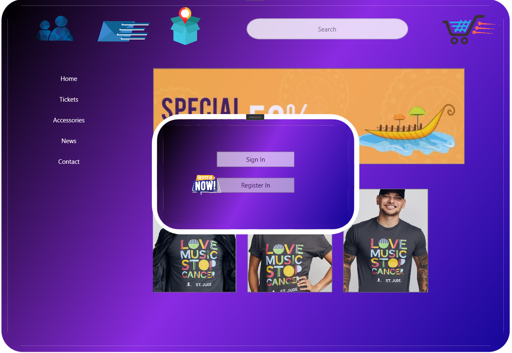
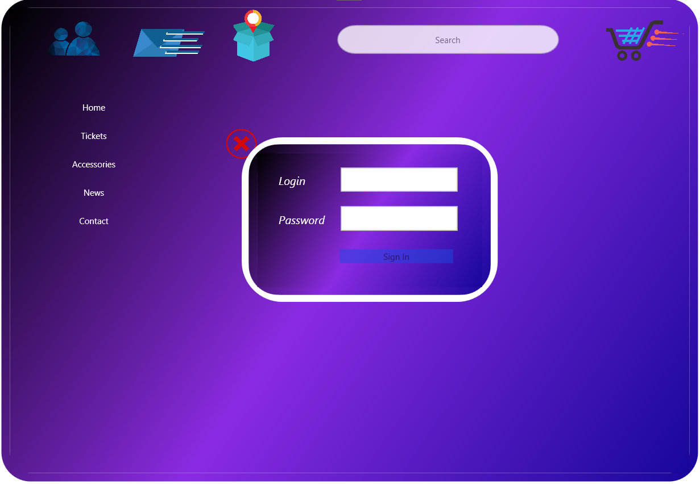
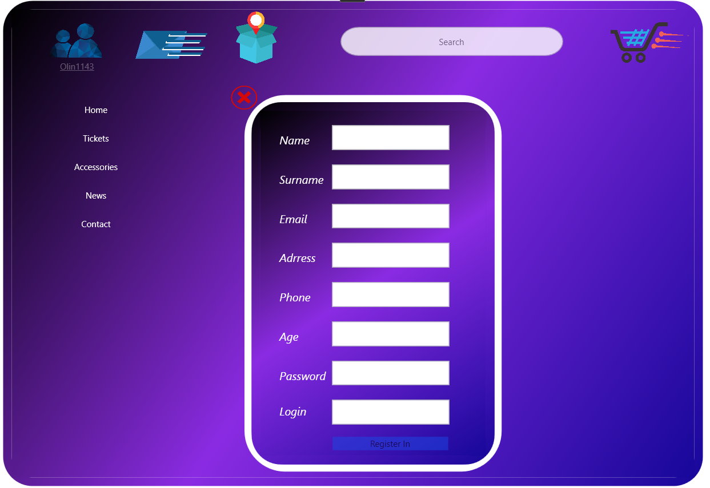
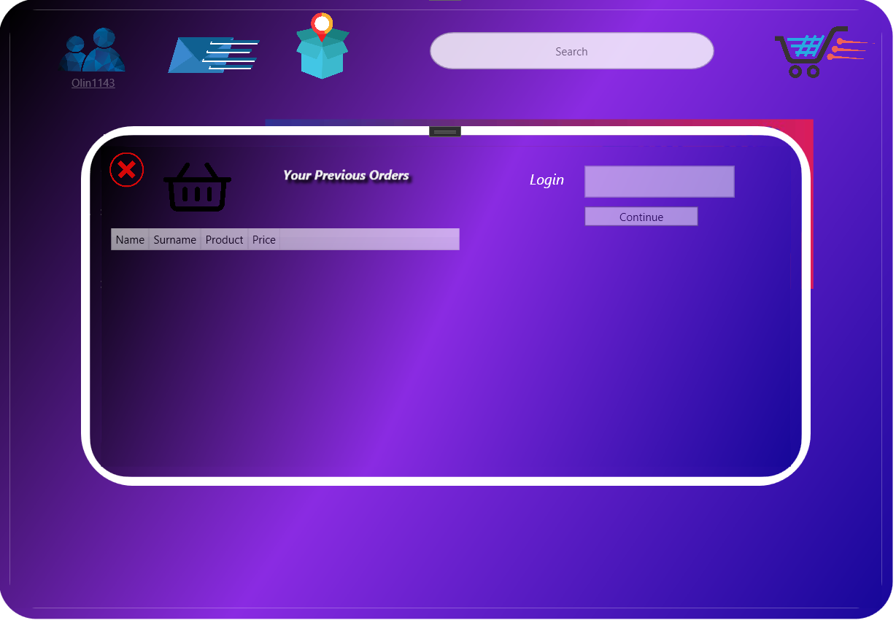
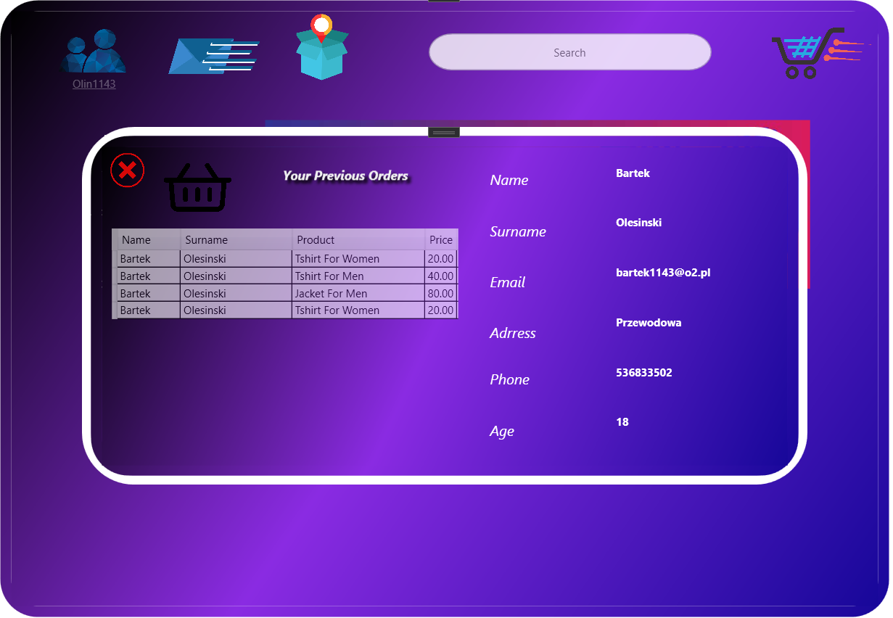
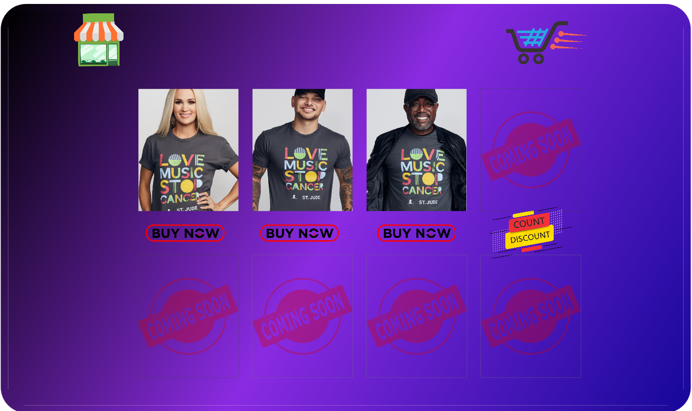
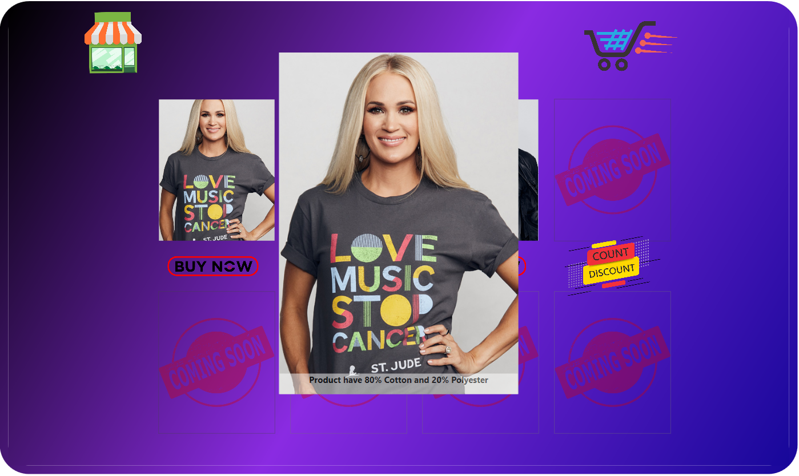
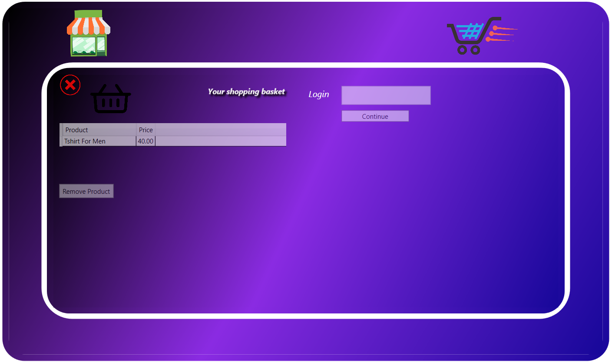
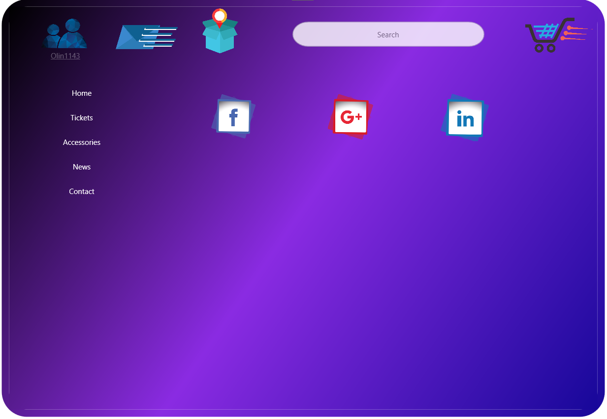

# MusicShop
## Application in WPF, modern UI

### Introduce to app

> The goal of this project is an intuitive and modern music store user interface.
> We can create our own account, log in, buy something and review your previous orders.
> Project use C# and XAML language.
#### Target Framework is .NET Framework 4.8

## Screenshots

### Features
- User registration
- User login
- Saving orders
- Reviewing previous orders
- By 'Contact' in left menu we can find profile of author(me)
- I've used animation on almost every button to make the app more modern

